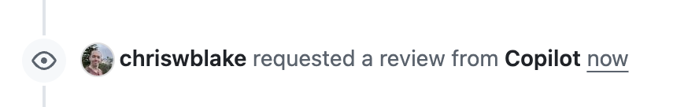

## Step 2: Get a Pull Request Review

Now that you've tested Copilot's local review capabilities and made some changes to improve the activities website, it's time to create a pull request and get Copilot's feedback on your proposed changes before they're merged into the main branch, just like one of the other teachers would. Let's see how Copilot reviews changes in the pull request process.

### 📖 Theory: Pull Request Code Reviews

GitHub Copilot analyzes your code and provides intelligent feedback with actionable suggestions you can apply instantly. Each code review consumes one Premium Request Unit (PRU) from the requester.

> [!IMPORTANT]
> Use [code review responsibly](https://docs.github.com/en/copilot/responsible-use/code-review) - It is familiar with many common security mistakes, but it is not meant to replace dedicated security analysis tools. Use the right tool for the job.

**Key Capabilities:**

- **Automated Analysis**: Reviews code for quality, security, and performance issues
- **Actionable Suggestions**: Provides specific recommendations with suggested code changes
- **Integration**: Works seamlessly with GitHub's native pull request flow, the same as regular peer feedback
- **Non-blocking**: Provides "Comment" reviews that don't block merging or count toward required approvals
- **Customizable**: Supports custom instructions to align with team standards
- **Secure**: Operates within GitHub's secure infrastructure

For more information, see the [GitHub Copilot code review documentation](https://docs.github.com/en/copilot/how-tos/use-copilot-agents/request-a-code-review).

### ⌨️ Activity: Request a review

1. If needed, open a another tab and for this exercise repository.

1. Start a new pull request. Enter the following details and click the **Create pull request** button.

   - **compare:** `add-announcement-banner`
   - **target:** `main`
   - **title:** `Add Announcement Banner`

1. In the right-side details area, find the **Reviewers** menu. Click on the **settings icon** to show a list of available reviewers and select **Copilot**.

   

1. Wait a moment for Copilot to review the changes and add comments to your pull request.

1. With the review requested, wait a moment for Mona to check your work, provide feedback, and share the next lesson.

> [!TIP]
> You can also use the GitHub CLI to assign Copilot as a reviewer!
>
> ```bash
> gh pr edit <PR_NUMBER> --add-reviewer "@copilot"
> ```

### ⌨️ Activity: (optional) Implement Copilot's feedback

1. (optional) Review Copilot's suggestions and implement them.

<!--
### ⌨️ Activity: Request another review

1. Based on the existing sample project, make some intentional changes that might trigger feedback:
   - Add some typos or unconventional variable naming
   - Introduce some grammar mistakes in comments
   - Add a coding pattern that could be improved
1. Push these changes to your branch
1. In the pull request reviewers menu, click the refresh icon next to Copilot's name to request a new review
1. Wait for Copilot to share additional comments on the pull request
1. Compare the new feedback with previous suggestions to see how Copilot adapts
1. -->

<details>
<summary>Having trouble? 🤷</summary><br/>

- Make sure you have a GitHub Copilot subscription - code reviews require a paid plan
- If Copilot doesn't appear in the reviewers list, ensure your repository has Copilot enabled
- Sometimes reviews take a minute or two to complete - be patient
- You can request multiple reviews on the same pull request by clicking the refresh icon

</details>
